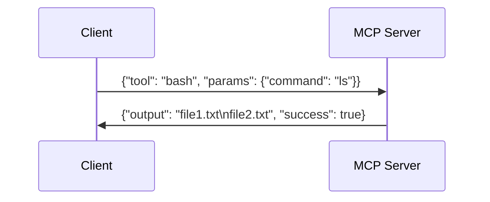

# OpenManus Tools Documentation

## Overview
OpenManus is a framework that enables AI agents to interact with systems through a collection of tools. These tools are exposed via the Model Context Protocol (MCP) server, allowing external systems to execute commands, manipulate files, browse the web, and more.

## Available Tools
| Tool Name | Description |
|----------|-------------|
| bash | Execute shell commands with full terminal emulation |
| browser_use | Control web browsers (navigation, forms, content extraction) |
| str_replace_editor | Edit files with surgical precision using string replacement |
| terminate | Cleanly end agent sessions |
| file_operators | Unified interface for file operations across local/sandboxed environments |
| web_search | Perform web searches across multiple engines |
| python_execute | Run Python code in isolated environments |
| ask_human | Request human input during execution |

## Detailed Tool Usage

### bash Tool
**Description**: Executes shell commands with full terminal emulation, supporting background processes and interactive sessions.

**Parameters**:
- `command` (string): The shell command to execute

**Example**:
```json
{
  "command": "ls -la"
}
```

### browser_use Tool
**Description**: Provides comprehensive browser automation capabilities including navigation, form interaction, and content extraction.

**Parameters**:
- `action` (string): Action to perform (go_to_url, click_element, etc.)
- `url` (string): Target URL for navigation
- `index` (integer): Element index for interactions
- `text` (string): Input text or search query
- [Other action-specific parameters]

**Example**:
```json
{
  "action": "go_to_url",
  "url": "https://example.com"
}
```

### str_replace_editor Tool
**Description**: Perform precise file edits by replacing exact string matches. Maintains file formatting and supports undo operations.

**Parameters**:
- `command` (string): Operation to perform (view, create, str_replace, etc.)
- `path` (string): Absolute file path
- `old_str` (string): Exact string to replace
- `new_str` (string): Replacement content

**Example**:
```json
{
  "command": "str_replace",
  "path": "/path/to/file.txt",
  "old_str": "old content",
  "new_str": "new content"
}
```

## Running the MCP Server
1. Install requirements: `pip install -r requirements.txt`
2. Start server: `python run_mcp_server.py`
3. Connect clients via stdio or SSE
4. Call tools using JSON-RPC format

## Example Workflow


## Troubleshooting
- Ensure required dependencies are installed
- Verify file paths are absolute
- Check browser configuration for automation tools
